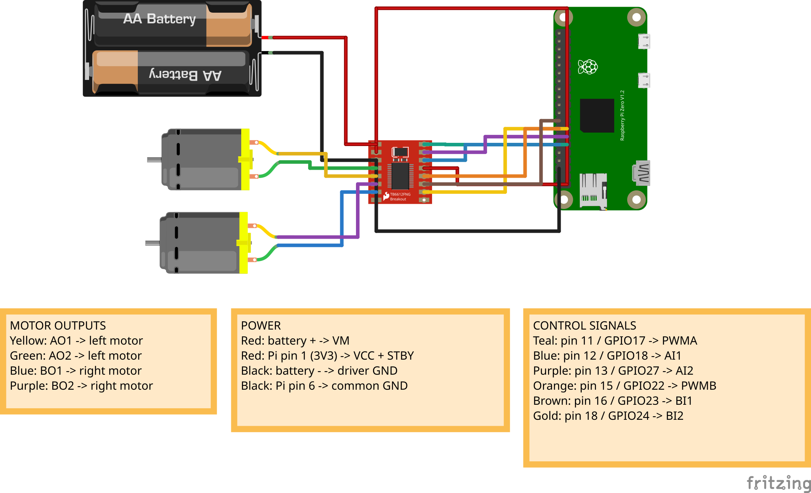
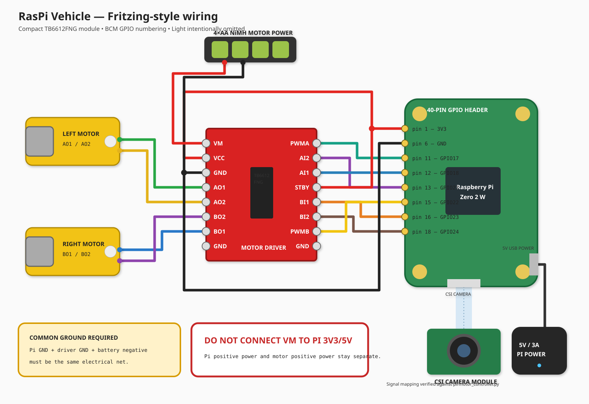
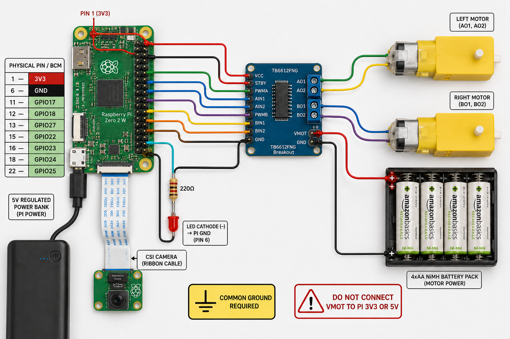
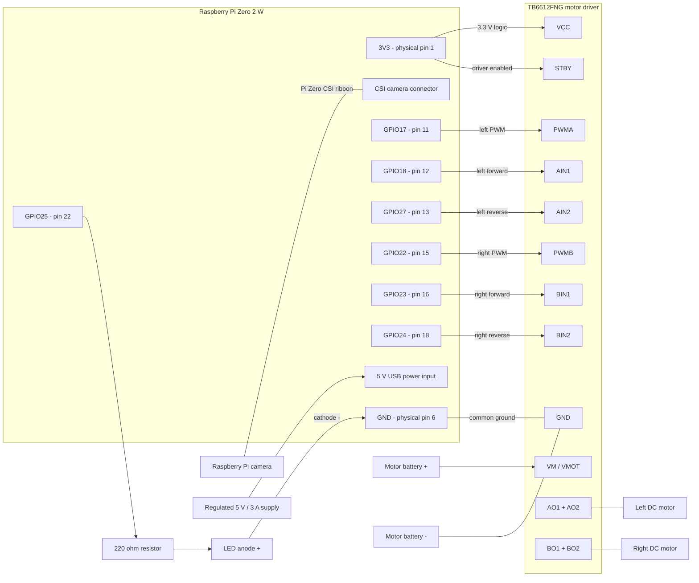

# Complete hardware wiring

## Native Fritzing project

[Open or download the editable Fritzing project](raspi-vehicle.fzz)



The native sketch uses Fritzing core parts for the Pi Zero, TB6612FNG, two DC
motors, and motor battery. The light is intentionally omitted. The Pi core part
does not expose CSI or USB power as electrical connectors, so connect the camera
ribbon and regulated 5 V USB supply physically as described below. The bundled
TB6612 artwork differs from the compact red board, but its logical AIN/BIN pins
correspond to the red module labels AI/BI.

Each project net is routed through two editable orthogonal bendpoints, with
separate lanes for power, ground, control signals, and motor outputs.


## Fritzing-style diagram (light omitted)

[Open the editable SVG diagram](raspi-vehicle-fritzing.svg)







This covers the Raspberry Pi Zero 2 W, TB6612FNG driver, two DC motors, CSI
camera, GPIO light, and both power supplies.

> **Disconnect both power sources before changing wiring.** Never connect motor
> battery positive (`VMOT`) to a Pi 3V3 or 5V pin.

## Connection schematic



Motor battery negative, driver ground, and Pi ground **must share a common
ground**. Keep positive supplies separate: regulated 5 V powers the Pi through
USB, while the motor battery powers only `VMOT`.

## Exact Pi pin connections

| Pi signal | Physical pin | Connect to | Purpose |
|---|---:|---|---|
| 3V3 | 1 | TB6612FNG `VCC` | Driver logic supply |
| 3V3 | 1 | TB6612FNG `STBY` | Enable driver |
| GND | 6 | TB6612FNG `GND` | Common ground |
| GPIO17 | 11 | TB6612FNG `PWMA` | Left speed/PWM |
| GPIO18 | 12 | TB6612FNG `AIN1` | Left direction 1 |
| GPIO27 | 13 | TB6612FNG `AIN2` | Left direction 2 |
| GPIO22 | 15 | TB6612FNG `PWMB` | Right speed/PWM |
| GPIO23 | 16 | TB6612FNG `BIN1` | Right direction 1 |
| GPIO24 | 18 | TB6612FNG `BIN2` | Right direction 2 |
| GPIO25 | 22 | 220 ohm resistor, then LED anode | Light output |
| GND | Any free GND | LED cathode | Light return |
| CSI connector | - | Camera ribbon | Camera data and power |
| USB power input | - | Regulated 5 V supply | Pi power |

## Motor and power connections

| Source | Connect to | Notes |
|---|---|---|
| Motor battery positive | `VM`, `VMOT`, or `VMCC` | Label varies by breakout |
| Motor battery negative | Driver GND and Pi GND | Required common reference |
| `AO1`, `AO2` | Left motor terminals | Swap pair if forward is reversed |
| `BO1`, `BO2` | Right motor terminals | Swap pair if forward is reversed |
| Regulated 5 V supply | Pi USB power input | Never connect to `VMOT` |

Use a supply compatible with the motors and driver. The current recommendation
is 4xAA NiMH. Before using a 2S LiPo, confirm the motors tolerate its fully
charged voltage and use suitable LiPo protection. Many 3-6 V TT motors should
not receive full 2S voltage directly.

## Camera and LED

Use the narrow Pi Zero CSI cable. Release each latch before inserting the cable,
keep it square, and close both latches evenly. Follow the markings on the exact
Pi and camera boards because ribbon orientation can vary.

```text
GPIO25 (physical pin 22) -> 220 ohm resistor -> LED anode (+)
LED cathode (-)          -> Pi GND
```

For a typical through-hole LED, the long leg is the anode and the flat body
edge marks the cathode. Do not drive a high-power lamp or LED strip directly
from GPIO25; use a suitable transistor or MOSFET driver.

## Header orientation

Physical pin numbers differ from BCM GPIO numbers. Python uses BCM names such
as `GPIO17`. With the Pi Zero USB ports at the bottom and header at the top,
physical pin 1 is top-left. Confirm it from the square pad or `3V3` marking.

## Before applying power

- Confirm `VMOT` does not connect to any Pi power pin.
- Check continuity between Pi GND, driver GND, and motor battery negative.
- Check for shorts between 3V3, 5V, `VMOT`, and GND.
- Confirm `VCC` and `STBY` connect to 3V3.
- Confirm the LED has a series resistor and correct polarity.
- Raise the wheels off the ground for the first motor test.
- Power the Pi first; connect motor power only when ready to test.
- Be ready to disconnect motor power immediately.

The code defaults are authoritative in `pi/motor_controller.py` and
`pi/light_controller.py`. Update this document when those assignments change.
